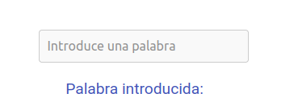

#  Tarea: Angular básico

_Enunciado:_

Realiza un ejemplo práctico usando componentes de Angular

* Que se actualice una variable
* Varios componentes

Sube a un repositorio todo el proyecto de Angular con readme explicando lo realizado

## Primeros pasos

En `src/index.html` agrego la etiqueta `<app-root></app-root>` al cuerpo del 
documento para cargar el componente principal de Angular,
quedando de la siguiente forma:

```html
<!doctype html>
<html lang="en">
<head>
  <meta charset="utf-8">
  <title>Prueba</title>
  <base href="/">
  <meta name="viewport" content="width=device-width, initial-scale=1">
  <link rel="icon" type="image/x-icon" href="favicon.ico">
</head>
<body>
  <app-root></app-root>
</body>
</html>
```

La siguiente etiqueta hace referencia al `selector` del archivo
`app.component.ts` de la carpeta `app`:

```ts
@Component({
  selector: 'app-root',
    ...
}
```

## Componentes y Estilos

Se han creado dos componentes principales: 
`body` y `palabra`, 
cada uno con su propio archivo HTML y CSS para la estructura y estilos.

### Componente `body`

El componente `body` muestra una imagen, un título y un contador que puede incrementarse o restablecerse mediante botones. 
Este componente se encuentra en la carpeta `app/body`.


### Componente `palabra`

El componente `palabra` permite al usuario introducir 
una palabra a través de un campo de entrada y muestra 
la palabra introducida. Este componente se encuentra en 
la carpeta `app/palabra`.




## Actualización de Variables

Ambos componentes permiten la 
actualización de variables. 
En el componente `body`, se actualiza 
el contador mediante los métodos `incrementarContador()` y
`resetContador()`. En el componente `palabra`, se actualiza la 
variable `palabraIntroducida` a través del enlace bidireccional 
`[(ngModel)]`.


_Pasos para incrementar el contandor_


_Pasos para reestablecer el contador_


_Introduciendo palabras en el campo de texto_

## Conclusión :end:

Este proyecto de Angular demuestra 
la creación de varios componentes y la actualización 
de variables dentro de ellos. Se han aplicado estilos 
CSS para mejorar la apariencia de los componentes y se
ha utilizado el enlace bidireccional `[(ngModel)]` para la
entrada de datos en el componente `palabra`.
